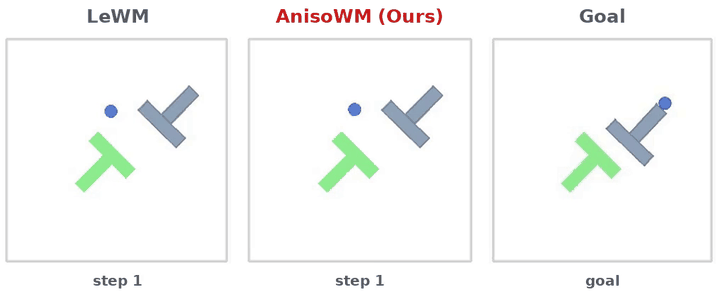
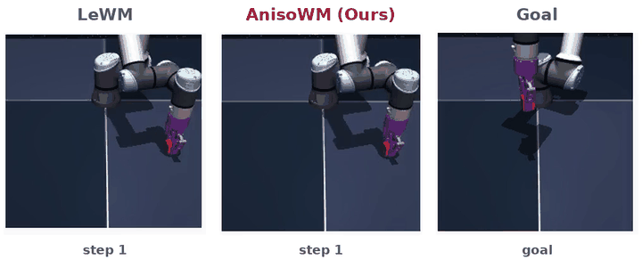
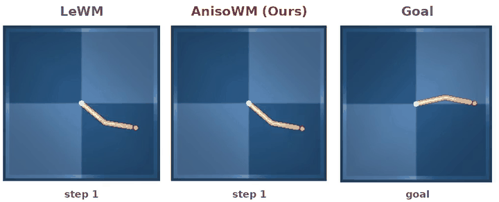
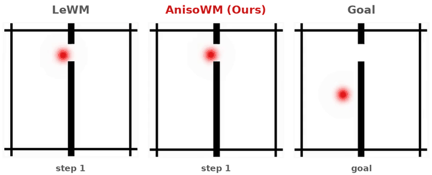
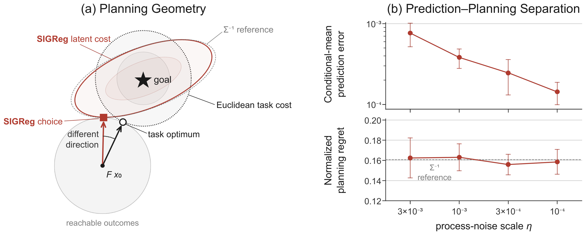
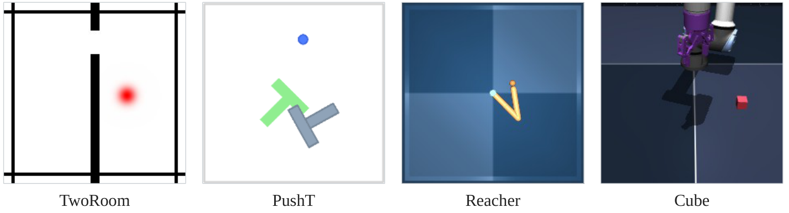
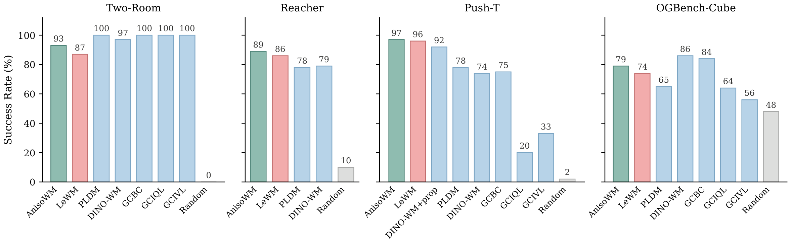
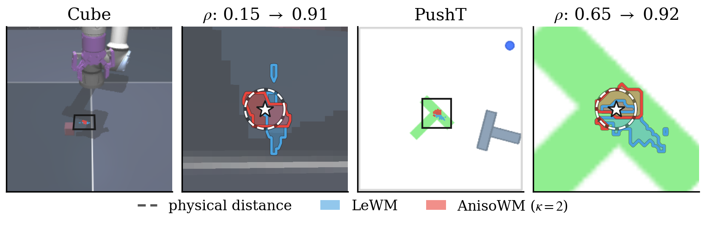
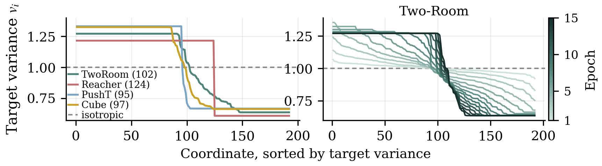

<div align="center">

# Anisotropic Representations Improve Planning<br>in JEPA World Models

**[Mingu Kang](https://rkdrn79.github.io/)**<sup>1</sup> &nbsp;·&nbsp; **[Yoori Oh](https://yoori000.github.io/)**<sup>1†</sup> &nbsp;·&nbsp; **[Sookyung Kim](https://agi.ewha.ac.kr/home)**<sup>2†</sup> &nbsp;·&nbsp; **[Joonseok Lee](http://www.joonseok.net/home.html)**<sup>1†</sup>

<sup>1</sup>Seoul National University &nbsp;&nbsp; <sup>2</sup>Ewha Womans University
<br><sup>†</sup>Corresponding authors

<a href="https://rkdrn79.github.io/AnisoWM-page/"></a>
<a href="https://arxiv.org/abs/2609.37441"></a>

<br>

<table>
  <tr>
    <td align="center"><b>Push-T</b></td>
    <td align="center"><b>OGBench-Cube</b></td>
  </tr>
  <tr>
    <td></td>
    <td></td>
  </tr>
  <tr>
    <td align="center"><b>Reacher</b></td>
    <td align="center"><b>Two-Room</b></td>
  </tr>
  <tr>
    <td></td>
    <td></td>
  </tr>
</table>

<sub>Same initial state, goal, CEM planner and random seed for both models. The frame border turns <b>green</b> on success and <b>red</b> on failure.</sub>

</div>

---

## TL;DR

> Latent world models plan by Euclidean distance to a goal representation, so the **regularizer that shapes the representation also shapes the planning cost**.
> The isotropic Gaussian target of SIGReg weights errors by the *inverse* state covariance, which can rank outcomes differently from the task.
> **AnisoWM** learns a bounded **anisotropic** target instead. It is a drop-in change to training only, and it **improves planning success in all four environments**.

## 🔍 Motivation: prediction is not planning

LeWM picks actions by minimizing the terminal latent cost with CEM,

```math
J_z(U) = \lVert \hat z_H(U) - z_g \rVert^2 .
```

If the encoder $A$ makes the features isotropic, $A\Sigma A^\top = sI$, this cost becomes

```math
\lVert A(x - x_g)\rVert^2 = s\,(x - x_g)^\top \Sigma^{-1} (x - x_g),
```

so low-variance directions get the largest weight. We prove that joint prediction–SIGReg training selects exactly this metric as process noise vanishes, even as prediction loss goes to zero. A finite-horizon construction then shows **positive planning regret with exact prediction**.

<p align="center">
  
</p>
<p align="center"><sub><b>Prediction–planning separation with a nonlinear encoder.</b> (a) The task cost and the SIGReg latent cost pick different outcomes from the same reachable set. (b) Prediction error falls as noise shrinks 30×, but planning regret stays near 0.16 over ten seeds.</sub></p>

## 🧭 Method: AnisoWM with ΛReg

We replace the fixed isotropic target with a learnable diagonal covariance $\Lambda$ under a fixed trace and a condition-number bound $\kappa$:

```math
\mathcal T_{D,\kappa} = \lbrace \Lambda \succ 0 : \mathrm{tr}\,\Lambda = D,\ \mathrm{cond}(\Lambda) \le \kappa \rbrace, \qquad \mathcal L = \mathcal L_{\text{pred}} + \lambda\, \mathcal R_N\left(\Lambda^{-1/2} Z_\theta\right).
```

- $\kappa = 1$ recovers the original SIGReg / LeWM.
- $\Lambda$ gets gradients only through ΛReg, so **predictive training decides how variance is allocated**.
- The predictor, prediction loss and Euclidean planner are **unchanged**, and $\Lambda$ is discarded after training.

## 📊 Results

We use the datasets, architecture and visual goal-planning protocol of LeWM.

<p align="center">
  
</p>

**Planning success.** With one shared bound $\kappa = 2$, AnisoWM beats LeWM in every environment. Both are trained in the same pipeline with three seeds.

<p align="center">
  
</p>

| Success rate (%) | Two-Room | Reacher | Push-T | OGBench-Cube |
|---|:-:|:-:|:-:|:-:|
| LeWM | 87 | 86 | 96 | 74 |
| **AnisoWM (Ours)** | **93** | **89** | **97** | **79** |

**Latent cost ordering.** On the same recorded action sequences, AnisoWM's planning cost $J_{\text{pred}}$ agrees better with the outcomes that were actually reached, in all four environments.

| Pairwise agreement | Two-Room | Reacher | Push-T | OGBench-Cube |
|---|:-:|:-:|:-:|:-:|
| LeWM | 0.575 | 0.676 | 0.594 | 0.537 |
| **AnisoWM (Ours)** | **0.646** | **0.723** | **0.621** | **0.553** |

**What the planner treats as "near the goal".** The lowest 10% of latent cost around a goal. LeWM's low-cost region spreads to positions far from the goal, while AnisoWM's stays close to the physical-distance disc.

<p align="center">
  
</p>

**Learned target spectra.** Under the same trace and $\kappa = 2$, each environment learns a different variance allocation, and the allocation keeps changing after the bound is reached.

<p align="center">
  
</p>

## 📝 Citation

```bibtex
@article{kang2026anisowm,
  title   = {Anisotropic Representations Improve Planning in JEPA World Models},
  author  = {Kang, Mingu and Oh, Yoori and Kim, Sookyung and Lee, Joonseok},
  journal = {arXiv preprint arXiv:2609.37441},
  year    = {2026}
}
```

## Acknowledgements

We build on [LeWorldModel (LeWM)](https://arxiv.org/abs/2603.19312) and SIGReg from [LeJEPA](https://arxiv.org/abs/2511.08544). The page template is adapted from [Nerfies](https://github.com/nerfies/nerfies.github.io).
